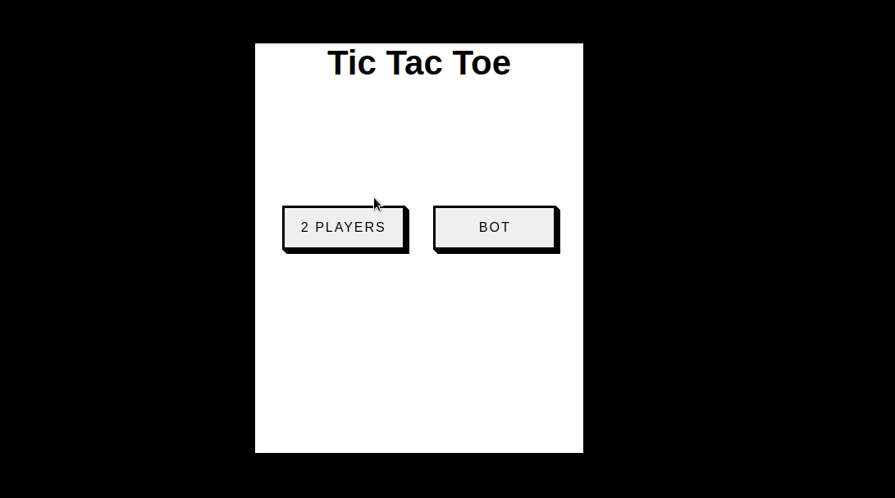
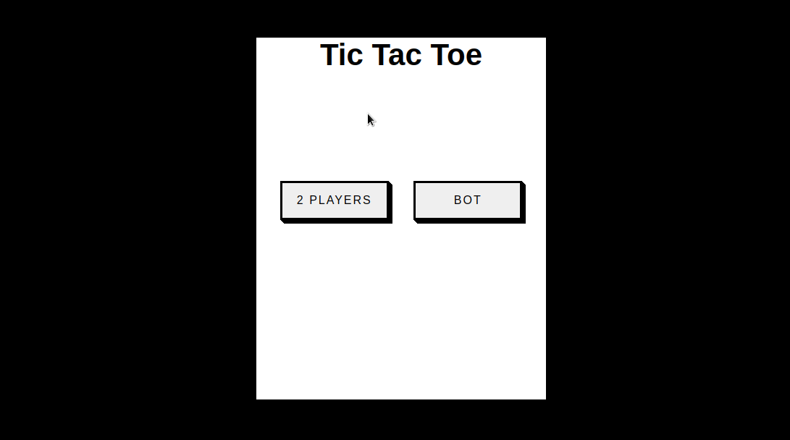

    

 
 <h1> Tic Tac Toe Game </h1>
 
This project is about Tic Tac Toe Game, developed in HTML5, CSS3 and JavaScript, in this project I've practiced logical and DOM manipulation.

 
In this game there are two ways to play, the first one you can play with another person, and in the second way to play is with a bot.

 

    <h5>2 Players</h5>
     
 

 

    <h5>Bot</h5>
     
 
